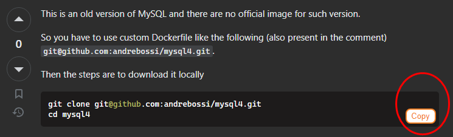

# StackCodeCopy Chrome Extension 

## Features

- Adds a "Copy" button next to code blocks on Stack Overflow
- Copies the code snippet to your clipboard with proper Markdown formatting
- Works on all StackOverflow posts

## Installation

1. Download the `https://github.com/prettyblueberry/stackcodecopy/archive/refs/heads/master.zip` file
2. Unzip the file
3. Go to the Chrome extensions page `chrome://extensions`
4. Enable "Developer mode"
5. Click "Load unpacked" and select the `stackcodecopy` folder
6. The extension will now be loaded in Chrome!

## Usage

1. Navigate to any StackOverflow post with code snippets
2. Click the "Copy" button next to a code block
3. The code will be copied to your clipboard, formatted with Markdown
4. Paste the code wherever you like!

## Contributing

Feel free to submit issues or pull requests to contribute to this project.